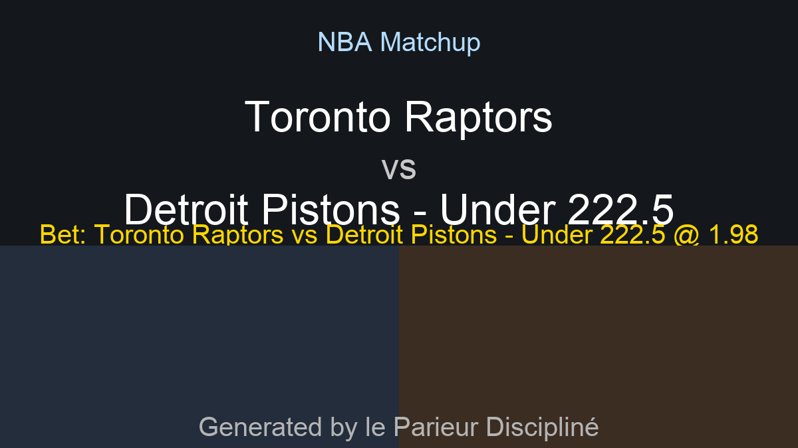

# Latest Predictions

## NBA (2026-02-11)
```
Date: 2026-02-11

Orlando Magic vs Milwaukee Bucks
Home odds: 1.22, Away odds: 4.5, O/U: 220.5
------
Charlotte Hornets vs Atlanta Hawks
Home odds: 1.51, Away odds: 2.66, O/U: 232.5
------
Cleveland Cavaliers vs Washington Wizards
Home odds: 1.07, Away odds: 9.1, O/U: 238.5
------
Toronto Raptors vs Detroit Pistons
Home odds: 2.06, Away odds: 1.81, O/U: 223.5
------
Philadelphia 76ers vs New York Knicks
Home odds: 1.74, Away odds: 2.16, O/U: 221.5
------
Boston Celtics vs Chicago Bulls
Home odds: 1.14, Away odds: 6.0, O/U: 224.5
------
Brooklyn Nets vs Indiana Pacers
Home odds: 1.53, Away odds: 2.6, O/U: 214.5
------
Houston Rockets vs Los Angeles Clippers
Home odds: 1.27, Away odds: 3.95, O/U: 208.5
------
New Orleans Pelicans vs Miami Heat
Home odds: 1.91, Away odds: 1.94, O/U: 231.5
------
Minnesota Timberwolves vs Portland Trail Blazers
Home odds: 1.36, Away odds: 3.25, O/U: 238.5
------
Phoenix Suns vs Oklahoma City Thunder
Home odds: 3.15, Away odds: 1.38, O/U: 217.5
------
Denver Nuggets vs Memphis Grizzlies
Home odds: 1.14, Away odds: 6.3, O/U: 237.5
------
Utah Jazz vs Sacramento Kings
Home odds: 1.39, Away odds: 3.1, O/U: 232.5
------
Golden State Warriors vs San Antonio Spurs
Home odds: 3.15, Away odds: 1.38, O/U: 221.5
------

AI Analysis Summary:
Here are your NBA betting recommendations, blending deep market analysis with critical situational insights:

### High Confidence

*   **New York Knicks ML vs Philadelphia 76ers**
    Knicks are currently in strong form, playing excellent defense, while the 76ers are without their key offensive superstar. Their defensive intensity and efficient scoring should exploit Philadelphia's compromised lineup.
*   **Denver Nuggets Under 237.5**
    The Grizzlies are severely impacted by injuries, significantly limiting their offensive production against a methodical and defensively capable Nuggets team. Denver controls the game's pace, further diminishing high-scoring opportunities for a short-handed opponent.
*   **Cleveland Cavaliers Under 238.5**
    Cleveland's stingy defense is among the league's best, consistently slowing down opponents and forcing tough shots. The Wizards, despite their pace, are prone to inefficiency and turnovers, which the Cavaliers are adept at punishing.

### Leans

*   **Brooklyn Nets Under 214.5**
    The Nets have shown defensive improvements and can limit opponents' scoring, while the Pacers' high-octane offense can be contained on the road when not fully firing. This low total indicates a potentially slower-paced game with controlled scoring.
*   **San Antonio Spurs ML vs Golden State Warriors**
    Without their star player Stephen Curry, the Warriors' offense struggles immensely, allowing the young Spurs team to capitalize on their disrupted rhythm. Victor Wembanyama and the Spurs' recent energetic play give them a significant advantage over a depleted Golden State.
*   **Charlotte Hornets ML vs Atlanta Hawks**
    The Hornets are playing with renewed energy at home against an Atlanta team that continues to struggle with consistency and key injuries. Charlotte's competitive spirit and home-court advantage position them well against a slumping Hawks squad.

---

**Bet of the Day:** New York Knicks ML vs Philadelphia 76ers @ 2.17
Reason: The New York Knicks are playing with significant momentum and boast a stifling defense, making them a formidable opponent. With the Philadelphia 76ers missing their dominant offensive force in Joel Embiid, their scoring and defensive anchor are severely compromised, creating a clear advantage for the disciplined and well-rounded Knicks.

```

<p align="center">
  
</p>

## NHL (2026-02-11)
```
Date: 2026-02-11


```

(No generated NHL image found)

